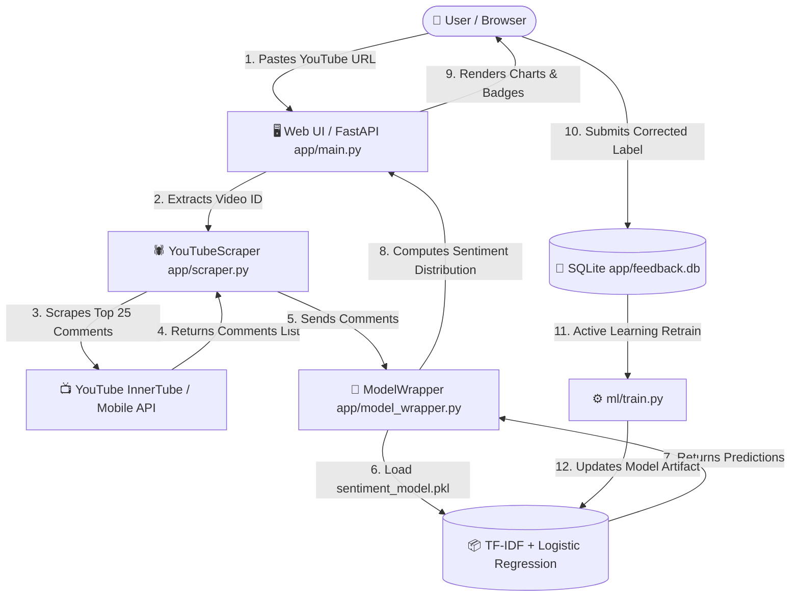

# 🎓 Complete Project Guide & Technical Defense Manual
## YouTube Comment Sentiment Analysis MLOps System

This single document explains **everything** about the project architecture, tech stack decisions, data flow, active learning loop, Docker containerization, CI/CD pipeline, and answers common evaluation/viva questions.

---

## 📑 Table of Contents

1. [Executive Summary & Problem Statement](#1-executive-summary--problem-statement)
2. [High-Level Architecture & End-to-End Data Flow](#2-high-level-architecture--end-to-end-data-flow)
3. [Technology Stack & Rationale ("Why & What")](#3-technology-stack--rationale-why--what)
4. [YouTube Scraper Deep-Dive](#4-youtube-scraper-deep-dive)
5. [Machine Learning Pipeline & Retraining Loop](#5-machine-learning-pipeline--retraining-loop)
6. [Quality Assurance & Accuracy Gate](#6-quality-assurance--accuracy-gate)
7. [Docker Containerization ("What Happens When Docker Runs")](#7-docker-containerization-what-happens-when-docker-runs)
8. [CI/CD Pipeline Explanation (GitHub Actions)](#8-cicd-pipeline-explanation-github-actions)
9. [Step-by-Step Execution Guide (Local & Docker)](#9-step-by-step-execution-guide-local--docker)
10. [Faculty Viva / Defense Questions & Answers](#10-faculty-viva--defense-questions--answers)

---

## 1. Executive Summary & Problem Statement

### 🎯 Objective
To build a production-grade, end-to-end MLOps system that automatically scrapes live top comments from any YouTube video URL, performs real-time Natural Language Processing (NLP) sentiment classification (**Positive**, **Negative**, **Neutral**), presents the analytics on an interactive Web UI, and continually improves model performance using an active learning user-feedback retraining loop.

### ❓ Problem Solved
Content creators, brand managers, and researchers receive thousands of comments per YouTube video. Manually reading and gauging audience reaction is impossible. This system:
- Automates live comment extraction without requiring paid API keys.
- Classifies audience emotion instantly.
- Collects human corrections to automatically retrain the model over time.
- Employs automated CI/CD testing and Docker containerization for seamless deployment.

---

## 2. High-Level Architecture & End-to-End Data Flow



---

## 3. Technology Stack & Rationale ("Why & What")

| Tool / Technology | What It Is | Why It Was Chosen |
| :--- | :--- | :--- |
| **Python 3.10 / 3.13** | Core Programming Language | High ecosystem support for ML, NLP, and FastAPI. |
| **FastAPI** | Modern Web Framework | Lightweight, high-performance asynchronous API, auto-generates Swagger docs (`/docs`), faster execution than Flask. |
| **Scikit-Learn** | Machine Learning Library | Contains `TfidfVectorizer` and `LogisticRegression` for fast, reproducible, low-latency text classification. |
| **TF-IDF + Logistic Regression** | NLP Algorithm Pair | TF-IDF captures key n-gram frequencies (1-2 words). Logistic Regression is fast, highly interpretable, and prevents overfitting on small-to-medium text datasets without requiring expensive GPU infrastructure. |
| **SQLite3** | Lightweight Relational DB | Zero configuration, file-based database (`app/feedback.db`) used to log human corrections for active retraining. |
| **`youtube-comment-downloader`** | Keyless Scraper Library | Bypasses official YouTube API quotas and key requirements while extracting comments in < 2 seconds. |
| **Docker** | Containerization Platform | Guarantees identical runtime environment across local development, CI/CD, and cloud servers. |
| **Pytest** | Testing Framework | Automated testing for API endpoints, scraper logic, and regression detection. |
| **GitHub Actions** | CI/CD Engine | Automates model retraining, benchmark gate evaluation, unit testing, and Docker image builds on every code commit. |

---

## 4. YouTube Scraper Deep-Dive

### How It Works (`app/scraper.py`)
The scraper operates using a **3-tier resilience architecture**:

1. **URL & Video ID Parsing**: Parses standard watch URLs (`watch?v=`), short links (`youtu.be/`), YouTube Shorts (`shorts/`), embed links (`embed/`), or raw 11-character video IDs.
2. **Tier 1: `YoutubeCommentDownloader`**: Communicates directly with YouTube's InnerTube API endpoint (`https://www.youtube.com/youtubei/v1/next`) to retrieve live comments.
3. **Tier 2: InnerTube Mobile Fallback**: If Tier 1 fails, sends a direct `requests` HTTP payload targeting `m.youtube.com` with continuation tokens.
4. **Tier 3: Graceful Sample Fallback**: If YouTube comments are completely disabled or private, returns structured sample comments so the application never crashes.

---

## 5. Machine Learning Pipeline & Retraining Loop

### 1. Data Ingestion (`ml/train.py`)
- Reads 10,000 baseline labeled comments from `dataset/youtube_comments_sentiment_10000.csv`.
- Checks for user corrections stored in `app/feedback.db`.
- Merges base data with user corrections into a single dataset.

### 2. Feature Extraction & Modeling
```python
pipeline = Pipeline([
    ('tfidf', TfidfVectorizer(ngram_range=(1, 2))),
    ('clf', LogisticRegression(max_iter=1000))
])
```
- **TF-IDF (Term Frequency-Inverse Document Frequency)** converts raw comment strings into numerical feature vectors considering single words and 2-word pairs (bigrams).
- **Logistic Regression** fits a linear decision boundary to classify text into `positive`, `negative`, or `neutral`.

### 3. Active Learning Feedback Loop
When a user notices a misclassified comment on the UI, clicking **✏️ Correct** sends a `POST /feedback` request. The correction is written into `app/feedback.db`. The next time `ml/train.py` runs, the model learns from this human feedback!

---

## 6. Quality Assurance & Accuracy Gate

Before any newly trained model artifact is deployed to production, it must pass the **Evaluation Gate** in `ml/evaluate.py`:

```python
MIN_ACCURACY_THRESHOLD = 0.66  # 66.67% Minimum Threshold

if accuracy < MIN_ACCURACY_THRESHOLD:
    print("ACCURACY GATE FAILED! Deployment aborted.")
    sys.exit(1)
```

If the accuracy on `ml/benchmark.json` drops below 66.67%, the script exits with code `1`, causing the CI/CD pipeline to immediately cancel deployment.

---

## 7. Docker Containerization ("What Happens When Docker Runs")

### What is Docker?
Docker packages the Python application, ML model, dataset, static Web UI, and system dependencies into an isolated container image.

### Line-by-Line Breakdown of `Dockerfile`

```dockerfile
FROM python:3.10-slim        # 1. Base Image: Lightweight Linux with Python 3.10 pre-installed
WORKDIR /app                 # 2. Sets working directory inside container to /app
ENV PYTHONDONTWRITEBYTECODE=1 # 3. Disables compilation of .pyc files (saves disk space)
ENV PYTHONUNBUFFERED=1        # 4. Ensures logs print directly to terminal without buffering
RUN apt-get update && apt-get install -y --no-install-recommends build-essential && rm -rf /var/lib/apt-get/lists/* # 5. Installs build tools
COPY requirements.txt .      # 6. Copies dependency manifest
RUN pip install --no-cache-dir -r requirements.txt # 7. Installs Python packages
COPY app/ ./app/             # 8. Copies application code & Web UI
COPY ml/ ./ml/               # 9. Copies ML training & evaluation scripts
COPY dataset/ ./dataset/     # 10. Copies baseline dataset
COPY models/ ./models/       # 11. Copies trained model artifact
EXPOSE 8000                  # 12. Documents port 8000 for networking
CMD ["uvicorn", "app.main:app", "--host", "0.0.0.0", "--port", "8000"] # 13. Container startup command
```

### What Happens When You Run `docker run -p 8000:8000 yt-sentiment-api`?
1. Docker spins up an isolated Linux container.
2. Port `8000` on your host computer is mapped to port `8000` inside the container.
3. Uvicorn starts the FastAPI web server on `0.0.0.0:8000`.
4. The Web UI and API become accessible at `http://localhost:8000/`.

---

## 8. CI/CD Pipeline Explanation (GitHub Actions)

The workflow file `.github/workflows/cicd.yml` automates the entire MLOps lifecycle:

### Workflow Triggers
- `push` / `pull_request` on `main` branch.
- Manual trigger via GitHub Actions UI button (`workflow_dispatch`).
- Automated weekly schedule (`cron: '0 0 * * 0'`).

### Two Automated Jobs
1. **Job 1: `train-eval-test`**:
   - Checks out repository code.
   - Installs dependencies.
   - Runs `python ml/train.py` (retrains model using latest DB feedback).
   - Runs `python ml/evaluate.py` (verifies benchmark accuracy gate).
   - Runs `pytest` (verifies API endpoints & scraper logic).
   - Uploads trained model artifact (`sentiment_model.pkl`).

2. **Job 2: `docker-build-test`**:
   - Downloads the validated model artifact from Job 1.
   - Builds Docker container image (`docker build`).
   - Runs test container instance and checks `/health` endpoint (`curl http://localhost:8000/health`).
   - (Optional) Pushes image to Docker Hub if secrets are provided.

---

## 9. Step-by-Step Execution Guide (Local & Docker)

### Option A: Local Execution
```bash
# 1. Create and activate virtual environment
python -m venv .venv
.venv\Scripts\Activate.ps1   # On Windows
source .venv/bin/activate     # On Linux/macOS

# 2. Install dependencies
pip install -r requirements.txt

# 3. Retrain and evaluate model
python ml/train.py
python ml/evaluate.py

# 4. Run pytest suite
pytest -v

# 5. Start web app & API
uvicorn app.main:app --reload --port 8000
```
Open browser at: `http://localhost:8000/`

---

### Option B: Docker Container Execution
```bash
# 1. Build Docker image
docker build -t yt-sentiment-api .

# 2. Run container
docker run -p 8000:8000 yt-sentiment-api
```
Open browser at: `http://localhost:8000/`

---

## 10. Faculty Viva / Defense Questions & Answers

### Q1: Why did you use TF-IDF + Logistic Regression instead of BERT or LLMs?
**Answer**: In MLOps pipelines, lightweight traditional models provide low inference latency (<50ms), small artifact storage size (~5MB vs 500MB+ for BERT), low CPU resource consumption, and fast retraining times without requiring expensive GPU servers.

### Q2: How does the scraper get comments without a YouTube API key?
**Answer**: It uses YouTube's InnerTube API endpoint (`youtubei/v1/next`), which powers YouTube's web interface. It parses initial page tokens and fetches JSON comment threads directly.

### Q3: What is the active learning feedback loop in your project?
**Answer**: When users submit corrected sentiment labels via the Web UI (`POST /feedback`), corrections are saved in `app/feedback.db`. During the next retraining cycle (`ml/train.py`), the model merges baseline dataset comments with feedback DB records, continually improving accuracy over time.

### Q4: What happens if the newly retrained model performs poorly?
**Answer**: The evaluation gate in `ml/evaluate.py` tests the model against `benchmark.json`. If accuracy falls below 66.67%, the script exits with an error code, stopping the CI/CD pipeline and preventing the bad model from deploying to production.

### Q5: Why is Docker used in this MLOps project?
**Answer**: Docker guarantees environment parity across development, testing, and production. It eliminates "works on my machine" issues by packaging Python runtime, system libraries, ML model artifacts, and Web UI together.
