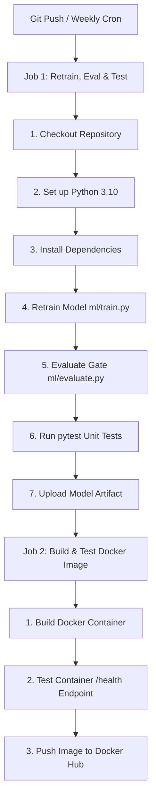

# YouTube Comment Sentiment Analysis (MLOps System)

> 📘 **FOR EVALUATORS / FACULTY**: Please see the comprehensive **[PROJECT_GUIDE.md](file:///c:/Users/ANIKET%20GUPTA/OneDrive/Desktop/PS-MLops/yt-sentiment-mlops/PROJECT_GUIDE.md)** for a complete single-file explanation of the project flow, architectural choices, Docker containerization, active learning feedback loop, CI/CD pipeline, and defense Q&A.

---

## 📁 Project Structure

```text
yt-sentiment-mlops/
├── PROJECT_GUIDE.md        # 📘 Comprehensive single-file project defense & architecture manual
├── .github/
│   └── workflows/
│       └── cicd.yml         # GitHub Actions CI/CD pipeline (Retraining, Eval, Test, Docker Build)
├── app/
│   ├── main.py              # FastAPI application & API endpoints (/review, /predict, /feedback)
│   ├── scraper.py           # Multi-tier YouTube comment scraper (top 20-25 comments)
│   ├── model_wrapper.py     # Sentiment prediction model loader & batch aggregator
│   ├── feedback.db          # SQLite database storing user feedback for active learning
│   └── static/              # Web UI static assets
│       ├── index.html       # Web dashboard template
│       ├── style.css        # Glassmorphism dark UI styling
│       └── script.js        # Dynamic API client & chart rendering
├── dataset/
│   └── youtube_comments_sentiment_10000.csv   # Baseline training dataset (10k comments)
├── ml/
│   ├── train.py             # Active learning retraining script (Dataset + Feedback DB)
│   ├── evaluate.py          # Benchmark model evaluation & accuracy gate
│   └── benchmark.json       # Benchmark test dataset
├── models/
│   └── sentiment_model.pkl  # Trained model artifact
├── tests/
│   └── test_api.py          # Unit tests for FastAPI endpoints & Scraper
├── Dockerfile               # Production Docker container image configuration
└── requirements.txt         # Project dependencies
```

---

## ⚙️ CI/CD Pipeline Workflow

The automated GitHub Actions workflow ([`.github/workflows/cicd.yml`](file:///.github/workflows/cicd.yml)) executes on `push`, `pull_request`, manual trigger (`workflow_dispatch`), or weekly schedule (`cron: '0 0 * * 0'`):



---

## 🚀 Quick Start

### 1. Installation & Environment Setup

```bash
# Create virtual environment
python -m venv .venv

# Activate virtual environment
# Windows PowerShell:
.venv\Scripts\Activate.ps1
# Linux/macOS:
source .venv/bin/activate

# Install dependencies
pip install -r requirements.txt
```

---

### 2. Train, Evaluate & Test Model Locally

```bash
# Retrain model (combining base 10k dataset + user feedback entries)
python ml/train.py

# Evaluate model against benchmark accuracy gate
python ml/evaluate.py

# Run unit tests
pytest -v
```

---

### 3. Run Web Application & API

```bash
uvicorn app.main:app --host 0.0.0.0 --port 8000 --reload
```

- **Web UI Dashboard**: Open `http://localhost:8000/` in your browser.
- **Swagger API Documentation**: Open `http://localhost:8000/docs`.

---

## 🐳 Docker Container Deployment

```bash
# Build Docker image
docker build -t yt-sentiment-api .

# Run container
docker run -p 8000:8000 yt-sentiment-api
```
